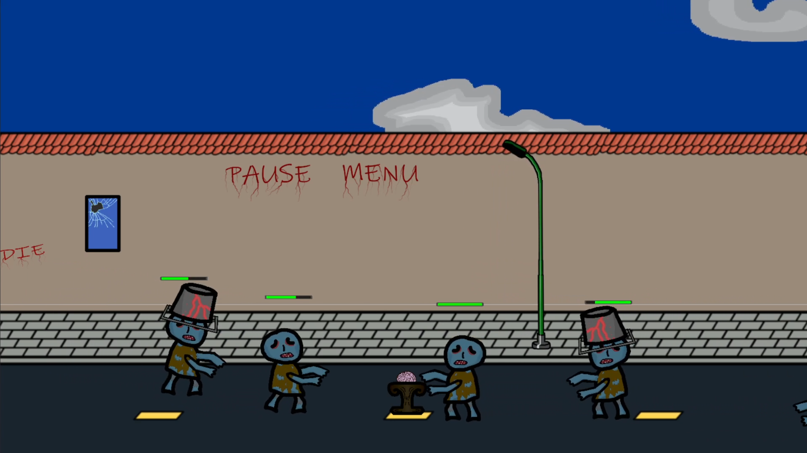

# BrainDefender
## Sections

 - [Visuals](#visuals)
 - [Description](#description)
	 - [General](#general)
	 - [Main features](#main-features)
	 - [Game Engine](#game-engine)
	 - [Programming languages and libraries](#programming-languages-and-libraries)
 - [Usage](#usage)
 - [TODO](#todo)

## Visuals

### Menu

### Gameplay

## Description

### General
Simple Game made in Unity (for android) (Not finished)  
Your goal is to stop zombies from eating the brain. Different types of zombies attack during waves. You can kill them by clicking on their bodies.

### Main features
  - Two types of zmobies
  - Animations
  - Pausing game

### Game Engine
- Unity

### Programming languages and libraries
 - C#

## Usage
 - Playing game

## TODO
 - Add scores
 - Add "eating brain animation" to zombies
 - Add brain's health bar
 - Add shop mechanics
 - Add "Game Over Menu"
